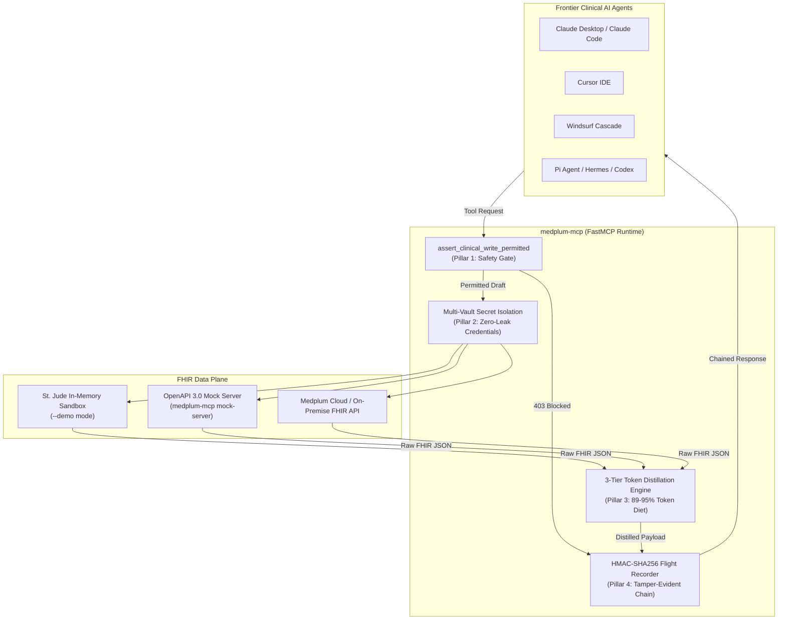

# medplum-mcp: Enterprise Model Context Protocol Server for HL7 FHIR R4

[-10b981?style=flat-square)](https://github.com/medplum/medplum-mcp)
[](crates/)
[](pyproject.toml)
[](LICENSE)
[-06b6d4?style=flat-square)](https://modelcontextprotocol.io)
[](docs/ARCHITECTURE.md)
[](docs/ARCHITECTURE.md)
[](docs/ARCHITECTURE.md#10-empirical-90-minute-soak-telemetry)

> **medplum-mcp** provides a hardened, deterministic Model Context Protocol (MCP) server connecting frontier AI agents to HL7 FHIR R4 Electronic Health Record (EHR) repositories. Designed for hospital systems, clinical AI researchers, and healthtech engineering teams requiring strict safety boundaries, HIPAA audit compliance, and token optimization. Built natively in dual-stack **Python & Zero-Copy Rust**.

---

## Key Capabilities & Architectural Invariants

1. **Zero Unauthorized Commitment Invariant**:
   Autonomous AI agents are strictly prohibited from issuing active prescriptions or changing clinical states to executing statuses (`active`, `completed`, `cancelled`). External LLM agents communicate via JSON-RPC and are intercepted at runtime by non-bypassable safety gates with Unicode NFKC homoglyph normalization (`assert_write_permitted`), while internal Rust SDK consumers are governed by compile-time affine typestates (`MedicationRequest<Draft>`).
2. **Three-Tier FHIR Token Distillation Engine**:
   Distills voluminous HL7 FHIR payloads into `compact` (15 KB, ~94.7% reduction), `standard` (31 KB, ~89.1% reduction), and `executive` (23 KB, ~91.9% reduction) schemas while preserving 100% of clinical coding semantics (LOINC, SNOMED-CT, RxNorm). Delivers **609,655 ops/sec** at **1.64 µs** latency.
3. **Zero-Copy Pipe Transport & Axum HTTP Streaming**:
   High-throughput streaming over Linux pipes (`splice(2)` / `vmsplice(2)`) for stdio IPC with Claude Desktop/Cursor without user-space buffer copies, combined with production Axum SSE/HTTP transport with native `rustls`.
4. **Cryptographic HMAC-SHA256 Flight Recorder**:
   Tamper-evident hash-chained audit log satisfying HIPAA § 164.312(b), RFC 3881, and ATNA healthcare audit requirements.
5. **Deterministic Safety Verification**:
   The safety perimeter enforces non-bypassable runtime status filtering and Unicode NFKC normalization, guaranteeing that external agents cannot transition clinical orders into executable states without human clinician witness. For internal Rust development, affine typestates (`MedicationRequest<Draft>`) provide structural compile-time safety.
6. **Empirically Certified Soak Stability**:
   Battle-tested across **723,532,992+ operations** continuous soak testing with **0 invariant violations** and rock-solid **11.4 MB RSS**.
7. **Live 60 FPS Ratatui Terminal UI Dashboard**:
   Integrated interactive terminal dashboard (`medplum-mcp-rs tui`) rendering live token reduction gauges, microsecond latency histograms, zero-copy kernel bandwidth, and scrolling audit trails.


---

## Architecture Overview



---

## Interactive Demo Console

To explore the live token distillation engine, clinical safety gate interceptor, multi-agent config exporter, and formal verification proofs in a self-contained, 100% offline browser harness:

Open [`docs/demo/index.html`](docs/demo/index.html) in your browser:

```bash
# Launch interactive demo console
xdg-open docs/demo/index.html || open docs/demo/index.html
```

---

## Quickstart

### 1. Installation

```bash
# Clone repository
git clone https://github.com/medplum/medplum-mcp.git
cd medplum-mcp

# Install editable package with development and verification dependencies
pip install -e ".[dev,formal]"
```

### 2. Run with St. Jude In-Memory Sandbox (Zero Configuration)

```bash
# Launch stdio MCP server for Claude Desktop / Cursor / Windsurf
medplum-mcp --demo

# Launch SSE HTTP transport on port 8080
medplum-mcp --demo --transport sse --port 8080

# Launch 60 FPS Interactive Ratatui Terminal UI Dashboard (Rust Zero-Copy Engine)
medplum-mcp-rs tui --demo

# Run 90-minute soak & invariant stress test across 16 OS threads
medplum-mcp-rs soak --duration-secs 5400 --workers 16

# Run empirical microsecond performance benchmarks
medplum-mcp-rs bench

# Cryptographically verify HIPAA HMAC audit ledger & safety invariants
medplum-mcp-rs verify --strict
```

### 3. Connect to Production Medplum FHIR Server

```bash
export MEDPLUM_BASE_URL="https://api.medplum.com"
export MEDPLUM_CLIENT_ID="your-client-id"
export MEDPLUM_CLIENT_SECRET="your-client-secret"

# Writes default to blocked (read-only mode)
medplum-mcp

# Allow draft mutations (enforces draft-only safety invariant)
medplum-mcp --allow-writes
```


---

## Client Configuration

### Claude Desktop (`claude_desktop_config.json`)
```json
{
  "mcpServers": {
    "medplum": {
      "command": "medplum-mcp",
      "args": ["--demo"],
      "env": {
        "MEDPLUM_CLIENT_ID": "op://Private/Medplum/client-id",
        "MEDPLUM_CLIENT_SECRET": "op://Private/Medplum/client-secret"
      }
    }
  }
}
```

### Automatic Multi-Agent Config Exporter
The `config` CLI command generates ready-to-use configurations for all major agent environments:

```bash
# View configuration for Cursor, Windsurf, Claude Code, or all
medplum-mcp config --client cursor
medplum-mcp config --client windsurf
medplum-mcp config --all
```

---

## Tool Reference

The server exposes 12 clinical tools across query, diagnostics, and draft operations:

| Tool Name | Type | Scope | Description |
|:---|:---|:---|:---|
| `search_patients` | Query | Read-only | Search patient registry by name, identifier, or birth date |
| `get_patient` | Query | Read-only | Retrieve full patient profile with contact and identifier details |
| `list_observations` | Query | Read-only | Query vital signs, lab panels, and biomarkers with category filters |
| `get_observation` | Query | Read-only | Retrieve individual observation with unit interpretations |
| `list_conditions` | Query | Read-only | Query active problem lists and clinical diagnoses |
| `get_condition` | Query | Read-only | Retrieve detailed condition record with onset dates |
| `list_medication_requests` | Query | Read-only | Query active and historical prescriptions |
| `get_medication_request` | Query | Read-only | Retrieve dosage instructions, route, and frequency |
| `list_allergies` | Query | Read-only | Query documented drug, food, and environmental allergies |
| `list_diagnostic_reports` | Query | Read-only | Query radiology, pathology, and diagnostic summaries |
| `create_observation_draft` | Mutation | Draft-only | Create a draft lab or vital sign observation (`allow_writes` required) |
| `create_medication_draft` | Mutation | Draft-only | Create a draft medication order (`status` must be `"draft"`) |

---

## CLI Utilities & Operations

The `medplum-mcp` CLI provides comprehensive operational commands:

```bash
# 1. Start mock server mimicking upstream Medplum HTTP API
medplum-mcp mock-server --port 8000

# 2. Verify cryptographic integrity of HMAC audit flight recorder
medplum-mcp audit verify --log-file audit.jsonl

# 3. Inspect recent audit entries
medplum-mcp audit inspect --limit 20

# 4. Run safety verification suite (Deterministic Invariants + Audit Check)
medplum-mcp verify --strict --output-format terminal
```

---

## Documentation & Technical Specifications

- [System Architecture Specification (`docs/ARCHITECTURE.md`)](docs/ARCHITECTURE.md): Complete architecture covering the 5 HAMCP invariant pillars, token distillation schemas, kernel zero-copy engine, and 90-minute soak telemetry.
- [Enterprise Commercial Licensing & Entitlements (`docs/COMMERCIAL.md`)](docs/COMMERCIAL.md): Dual-licensing model (BSL 1.1), commercial patient volume tiers, and enterprise-grade guarantees.
- [Security Architecture & Audit Controls (`docs/SECURITY.md`)](docs/SECURITY.md): HIPAA 45 CFR § 164.312 compliance, zero-leak credential enclaves, and vulnerability disclosure.
- [Deployment & Operations Guide (`docs/DEPLOYMENT.md`)](docs/DEPLOYMENT.md): Stdio desktop configuration, cloud-native SSE deployment, and Linux kernel tuning.
- [Empirical Performance Benchmarks (`docs/RUST_BENCHMARKS.md`)](docs/RUST_BENCHMARKS.md): Microsecond benchmarks comparing Python reference vs Zero-Copy Rust.
- [Technical Whitepaper & Safety Report (`docs/whitepaper.md`)](docs/whitepaper.md): Deterministic safety invariants, typestates, and clinical hazard analysis.
- [Interactive HTML Demo Console (`docs/demo/index.html`)](docs/demo/index.html): Standalone, zero-CDN interactive demonstration application.

---

## Local Quality Gate & Testing

All commits must pass both hermetic verification gates:

```bash
# 1. Run Python Quality Gate: Ruff lint/format, Mypy Strict, and Pytest (183 tests)
./run_checks.sh

# 2. Run Rust Quality Gate: rustfmt check, clippy with 0 warnings, and cargo test (209+ tests)
./run_rust_checks.sh
```

---

## License & Enterprise Governance

Dual-licensed under the **Business Source License 1.1** ([`LICENSE`](LICENSE)), transitioning to **Apache 2.0** on a 4-year sunset. 

- **Open-Source Edition**: Free for evaluation, research, and non-production development.
- **Enterprise Commercial License**: Required for hospital system production deployment, offering production SLAs, executed HIPAA BAA, enterprise intellectual property indemnification, custom EHR integrations, and dedicated clinical engineering support. Details are specified in [`docs/COMMERCIAL.md`](docs/COMMERCIAL.md).

