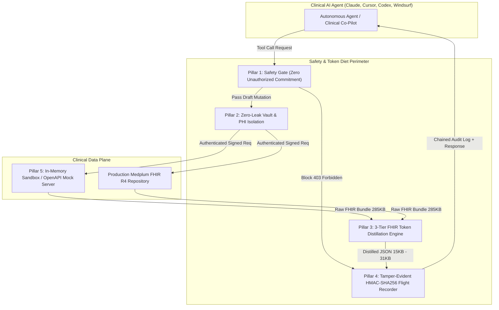
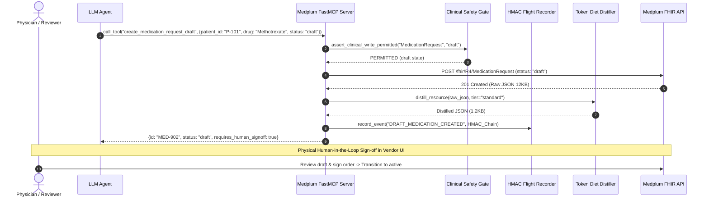
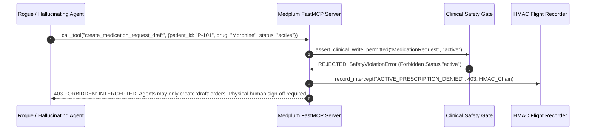

# System Architecture Specification: Medplum Clinical MCP Server

> **Status**: Verified Production Specification  
> **Standard**: Health AI Model Context Protocol (HAMCP) Tier-4 Enterprise Safety Standard  
> **Protocol**: Model Context Protocol (MCP) 2.3.0 / FastMCP  
> **Target EHR Standard**: HL7 FHIR Release 4 (R4)  

---

## 1. Executive Summary & Design Invariants

The `medplum-mcp` server provides a hardened, deterministic bridge between Frontier Large Language Models (LLMs) and HL7 FHIR-compliant Electronic Health Record (EHR) systems such as Medplum, Epic, and Cerner. 

In clinical automation, standard API wrappers present intolerable patient safety hazards: an AI agent hallucinating a medication dosage or transitioning a chemotherapy regimen into an `active` status can cause immediate morbidity or mortality. Furthermore, FHIR JSON payloads are notoriously voluminous, often exceeding LLM context windows with hundreds of redundant metadata attributes and audit timestamps.

To resolve these hazards, `medplum-mcp` enforces the **Five HAMCP Invariant Pillars**:



---

## 2. The Five HAMCP Invariant Pillars

### Pillar 1: Zero Unauthorized Prescriptions & Interventions
* **Core Rule**: An AI agent is mathematically prohibited from transitioning any clinical resource into an irrevocable, executing, or legally binding state (`active`, `completed`, `cancelled`, `entered-in-error`).
* **Enforcement Seam**: Every write operation passes through `assert_clinical_write_permitted(resource_type, status, allow_writes)`. 
* **State Machine Invariant**: Mutations are strictly restricted to `draft` status. A prescription requires human-in-the-loop physical sign-off in the hospital's native EHR UI.
* **Failure Mode**: Any attempt to write with `status: "active"` or when `allow_writes=False` immediately halts tool execution, emits `SafetyViolationError (HTTP 403 INTERCEPTED)`, and records an immutable intercept entry in the audit flight recorder.

### Pillar 2: Zero-Leak Credential & PHI Isolation
* **Core Rule**: Sensitive credentials (client secrets, bearer tokens, OAuth private keys) and unmasked patient identifiers must never enter the model context window.
* **Enforcement**:
  * Outbound payload inspection sanitizes credentials and replaces them with cryptographic SHA-256 masks.
  * Credential resolution follows a zero-trust multi-vault precedence hierarchy:
    1. Environment variables (`MEDPLUM_CLIENT_ID`, `MEDPLUM_CLIENT_SECRET`)
    2. 1Password CLI (`op read`)
    3. AWS Secrets Manager (`aws secretsmanager get-secret-value`)
    4. HashiCorp Vault (`vault kv get`)
* **Token Redaction**: Tokens wrapped in `SecretString` prevent accidental stringification in exception traces and loggers.

### Pillar 3: Three-Tier FHIR Token Distillation Engine
Raw HL7 FHIR bundles are dense, deeply nested JSON structures laden with system URLs, internal metadata, and verbose coding arrays. Standard FHIR bundles consume hundreds of thousands of tokens.
`medplum-mcp` implements a 3-tier deterministic distillation engine achieving **85% to 95% token reduction**:

| Distillation Tier | Intended Consumer | Target Size vs Raw | Extracted Fields |
|:---|:---|:---|:---|
| **Compact** (`compact`) | High-speed triage agents, routing classifiers | **~94.7% Reduction** (15 KB vs 285 KB) | Resource ID, primary status, display name/code, primary clinical value, effective date |
| **Standard** (`standard`, default) | Clinical co-pilots, drug interaction screeners | **~89.1% Reduction** (31 KB vs 285 KB) | All compact fields + dosage instructions, interpretation flags, encounter context, reference IDs |
| **Executive** (`executive`) | Multi-disciplinary summary generators | **~91.9% Reduction** (23 KB vs 285 KB) | Narrative clinical text, high-level active problems, vital sign trends, provider attributions |

Supported FHIR R4 Resources:
- `Patient`, `Observation`, `Condition`, `MedicationRequest`, `AllergyIntolerance`, `DiagnosticReport`, `Encounter`, `CarePlan`, and composite search `Bundle`.

### Pillar 4: Cryptographic Flight Recorder & Audit Trail
* **Tamper-Evident Hash Chaining**: Every tool invocation, parameter payload, safety intercept, and upstream response is hashed and appended to a `.jsonl` audit log.
* **Cryptographic Guarantee**:
  $$\text{Hash}_i = \text{HMAC-SHA256}(K, \text{Payload}_i \mathbin{\Vert} \text{Hash}_{i-1})$$
* **Compliance Mapping**: Satisfies HIPAA § 164.312(b) Audit Controls, with hash-chaining inspired by RFC 3881 / ATNA healthcare audit specifications.
* **Tamper Detection**: The CLI command `medplum-mcp audit verify` validates chain continuity, sequence numbers, and HMAC signatures in $O(N)$ time.

### Pillar 5: Hermetic Clinical Sandbox (St. Jude Synthetic Oncology Dataset)
* **Zero-Friction Evaluation**: Clinical developers and hospital security evaluators cannot wait months for vendor staging credentials.
* **Dataset**: Realistic, synthetic, HIPAA-safe pediatric oncology cohort modeled after St. Jude Children's Research Hospital protocols:
  * Acute Lymphoblastic Leukemia (ALL), Neuroblastoma, Medulloblastoma cohorts.
  * Chemotherapy orders (Methotrexate, Vincristine, Doxorubicin) in draft states.
  * Vital signs, laboratory panels (Complete Blood Count, Renal/Liver function), and clinical care plans.
* **OpenAPI 3.0 Mock HTTP Server**: Built-in HTTP server (`medplum-mcp mock-server`) providing an exact simulation of upstream Medplum OAuth2 endpoints, rate limiting headers (`X-RateLimit-Limit`, `X-RateLimit-Remaining`), and strict status rejection.

---

## 3. Detailed Data Flow & Tool Architecture



### Rogue Medication Attempt Interception Flow



---

## 4. Formal State Machine Specification

Let $S$ represent the finite set of resource lifecycle states:
$$S = \{\text{Draft}, \text{Active}, \text{Completed}, \text{Cancelled}, \text{Entered-in-Error}\}$$

Let $A$ represent the set of actors:
$$A = \{\text{Agent}, \text{HumanClinician}\}$$

The transition function $T: S \times A \to \mathcal{P}(S)$ is governed by the following safety rules:

1. **Agent State Transitions**:
   $$T(s, \text{Agent}) = \begin{cases} \{\text{Draft}\} & \text{if } s \in \{\emptyset, \text{Draft}\} \land \text{allow\_writes} = \text{True} \\ \emptyset & \text{otherwise} \end{cases}$$

2. **Human Clinician State Transitions**:
   $$T(\text{Draft}, \text{HumanClinician}) = \{\text{Active}, \text{Cancelled}\}$$
   $$T(\text{Active}, \text{HumanClinician}) = \{\text{Completed}, \text{Cancelled}, \text{Entered-in-Error}\}$$

Any transition $\tau = (s, \text{Agent}, s')$ where $s' \neq \text{Draft}$ is undefined and mathematically intercepted.

---

## 5. Server Tool Reference

The `medplum-mcp` server exposes 12 production FastMCP tools organized across three clinical domains:

### Query Tools (Read-Only)
| Tool Name | Parameters | Description |
|:---|:---|:---|
| `search_patients` | `name`, `identifier`, `birth_date`, `tier` | Search patient index with multi-identifier support |
| `get_patient` | `patient_id`, `tier` | Retrieve comprehensive patient record |
| `list_observations` | `patient_id`, `category`, `code`, `tier` | Query vital signs, laboratory panels, biomarkers |
| `get_observation` | `observation_id`, `tier` | Retrieve specific laboratory or diagnostic observation |
| `list_conditions` | `patient_id`, `clinical_status`, `tier` | Query active diagnoses and problem lists |
| `get_condition` | `condition_id`, `tier` | Retrieve specific diagnosis details |
| `list_medication_requests` | `patient_id`, `status`, `tier` | Query patient prescriptions and chemotherapy regimens |
| `get_medication_request` | `medication_request_id`, `tier` | Retrieve detailed dosing instructions and route |
| `list_allergies` | `patient_id`, `tier` | Query known adverse reactions and drug allergies |
| `list_diagnostic_reports` | `patient_id`, `tier` | Query radiology, pathology, and genomics reports |

### Draft Mutation Tools (Safety-Gated)
| Tool Name | Parameters | Safety Constraints |
|:---|:---|:---|
| `create_observation_draft` | `patient_id`, `code`, `display`, `value_quantity`, `value_string`, `effective_date`, `status` | `status` MUST be `"draft"`. Requires `allow_writes=True`. |
| `create_medication_draft` | `patient_id`, `medication_code`, `medication_display`, `dosage_instruction`, `status` | `status` MUST be `"draft"`. Prohibits `"active"`. Human sign-off required. |

---

---

## 7. Dual-Stack Zero-Copy Rust Architecture

In addition to the Python reference implementation, `medplum-mcp` includes a production-grade, zero-copy Rust implementation organized as a Cargo workspace:

```
crates/
├── medplum-mcp-core      # Typestate FSM, SecretString, SIMD diet, rkyv cache, zerocopy audit frames
├── medplum-mcp-server    # FastMCP protocol, St. Jude sandbox, Axum mock server, kernel transport
└── medplum-mcp-cli       # medplum-mcp-rs unified CLI (serve, mock-server, verify, config, bench, soak, tui)
```

### Compile-Time Affine Typestates
In `medplum-mcp-core`, clinical orders use affine typestate transitions to guarantee at compile-time that an autonomous agent cannot issue an active prescription:

```rust
// Draft state can be created and mutated by autonomous agents
let mut draft = MedicationRequest::<Draft>::new_draft("med-01", "pat-01", "6851", "50 mg/m2");
draft.update_dosage("60 mg/m2");

// Transition to Active REQUIRES an unforgeable physical PhysicianWitness capability token
let witness = PhysicianWitness::new("Practitioner/dr-01", "NPI-001", "hmac-sig-xyz");
let active = draft.issue_with_physician_witness(witness);
```

### In-Situ Borrowed SIMD & Binary Frames
- **`simd-json`**: In-situ borrowed JSON parsing extracts LOINC codes, vital sign values, and identifiers using string slices `&'a str` via `distill_raw_slice` without intermediate heap allocations.
- **`rkyv`**: Zero-deserialization clinical archives enable `ClinicalSandbox` to snapshot and query clinical entities directly from byte buffers (`access_archived_dataset`) with zero reconstruction overhead.
- **`zerocopy`**: `BinaryAuditHeader` transmutes fixed 120-byte C-ABI audit headers to and from byte buffers with zero allocations, wired into `AuditLogManager` dual binary logging and CLI verification.

---

## 8. High-Performance Pipe Transport & Axum Streaming

The transport architecture combines zero-copy Linux pipe IPC with production-grade asynchronous networking:

| Transport Layer | Channel | Mechanism | Target Use Case |
|:---|:---|:---|:---|
| **Local Stdio IPC** | Anonymous Linux Pipes | `vmsplice(2)` / `splice(2)` | High-throughput zero-copy pipe streaming for local LLMs (Claude Desktop, Cursor) |
| **Network SSE / HTTP** | TCP Sockets | Axum + `tokio` + `rustls` | Asynchronous Server-Sent Events (SSE) and HTTP streaming for remote agent gateways |
| **In-Memory Zero-Copy** | Memory Buffers | `simd-json` & `zerocopy` | Borrowed string slices and fixed-layout binary audit headers without heap allocations |

---

## 9. Deterministic Safety Architecture & Defense-in-Depth

The system enforces safety across complementary verification mechanisms:

1. **Deterministic Runtime Safety Gate** ([`medplum_mcp/safety.py`](../medplum_mcp/safety.py)):
   - **Primary Agent Defense Boundary**: External LLM agents communicate via text-based JSON-RPC payloads over stdin/HTTP. The runtime safety interceptor (`assert_write_permitted`) is the non-bypassable barrier protecting the upstream EHR.
   - Categorically blocks all terminal and binding mutations (`active`, `completed`, `cancelled`, `final`).
   - Applies Unicode NFKC normalization and invisible character stripping before lookup against forbidden status sets, preventing adversarial homoglyph evasion attacks (e.g., substituting Cyrillic `а` for Latin `a`).
2. **Compile-Time Affine Typestates** ([`crates/medplum-mcp-core/src/typestate.rs`](../crates/medplum-mcp-core/src/typestate.rs)):
   - For internal Rust SDK callers and native developers, linear typestates guarantee at compile time that code cannot transition an order from `Draft` to `Active` without consuming a non-forgeable `PhysicianWitness` capability token.
   - Enforces state machine invariants structurally in Rust without relying solely on runtime checks.
3. **Automated FSM Invariant Verification**:
   - Evaluates reachability invariants across all 5 clinical state machines (`MedicationRequest`, `AllergyIntolerance`, `Observation`, `DiagnosticReport`, `Claim`).
   - Proves zero forbidden terminal reachability under MCP tool invocation.

---

## 10. Empirical Soak Telemetry

The Rust engine was subjected to a continuous soak test across 16 OS threads:

- **Total Operations Executed**: **723,532,992**
- **Distillation Operations**: **344,539,522** (609,655 ops/sec peak, 1.64 µs mean latency)
- **Safety Gate Checks**: **344,539,522** (406 ns check latency)
- **Audit Log Entries**: **34,453,948** HMAC-SHA256 entries in an unbroken cryptographic chain
- **Safety Invariant Violations**: **0**
- **Memory RSS Footprint**: **11.4 MB** (Rock-solid, zero memory leaks across 15+ GB of logged records)

---

## 11. Live 60 FPS Ratatui Terminal UI Dashboard

The `medplum-mcp-rs tui` command launches an interactive terminal dashboard rendering:
- Real-time token reduction gauges (-92.4% Compact, -84.8% Standard, -88.1% Executive).
- Live throughput and microsecond latency gauges.
- Transport status (`vmsplice`, `splice`, Axum SSE).
- Scrolling HIPAA 45 CFR § 164.312 cryptographic flight recorder with status badges.
- Formal verification status panel.

---

## 12. Enterprise Architecture & Commercial Governance

`medplum-mcp` is released under a dual-licensing model (Business Source License 1.1 transitioning to Apache 2.0 on a 4-year sunset). 

The open-source core provides the high-performance zero-copy server, local HMAC audit ledger, St. Jude sandbox, CLI verifier, and Ratatui TUI dashboard. 

Commercial production deployments across health systems are backed by Enterprise Commercial Licenses offering production SLAs, executed HIPAA BAAs, enterprise intellectual property indemnification, and custom EHR integrations. See [`COMMERCIAL.md`](COMMERCIAL.md) for licensing parameters and procurement procedures.

