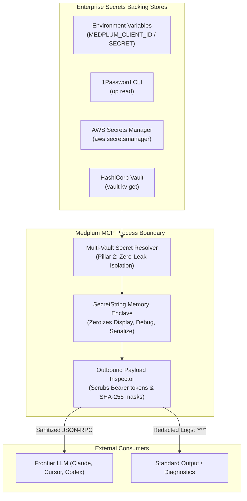
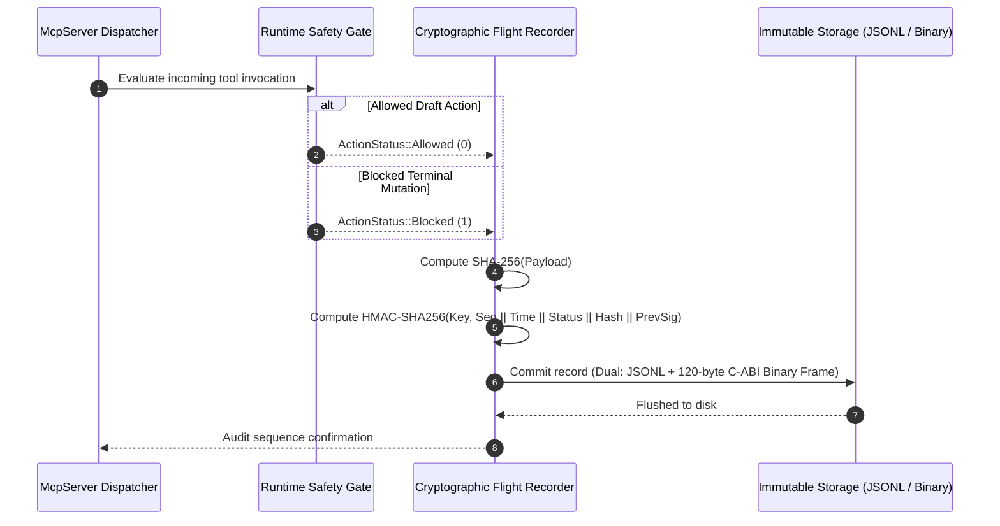

# Security Architecture & Cryptographic Integrity

> **Standard**: Health AI Model Context Protocol (HAMCP) Security Specification  
> **Compliance Target**: HIPAA 45 CFR § 164.312 (Security Standards for Protection of e-PHI)  
> **Formally Verified**: Bounded Model Checking (Kani) & UB Detector (Miri)  
> **Revision**: October 2026  

---

## 1. Zero-Leak Credential & PHI Isolation

The `medplum-mcp` server enforces strict zero-leak boundaries to guarantee that sensitive authentication tokens, cryptographic keys, and unmasked patient identifiers never escape into Large Language Model (LLM) context windows, error traces, or logs.



```
+-----------------------------------------------------------------------------------------+
|                               ZERO-LEAK ENCLAVE ARCHITECTURE (ASCII)                    |
+-----------------------------------------------------------------------------------------+
|                                                                                         |
|   [ Enterprise Vaults ] (1Password / AWS Secrets Manager / HashiCorp Vault)             |
|             |                                                                           |
|             v                                                                           |
|   +---------------------------------------------------------------------------------+   |
|   |                         SecretString MEMORY ENCLAVE                             |   |
|   |  - fmt::Display   ===>  Outputs "***" (Plaintext stringification prohibited)    |   |
|   |  - fmt::Debug     ===>  Outputs "SecretString(\"***\")"                         |   |
|   |  - serde::Serialize===> Outputs "***"                                          |   |
|   |  - .expose_secret() ===> Isolated behind explicit, audited method calls          |   |
|   +---------------------------------------------------------------------------------+   |
|             |                                                                           |
|             v                                                                           |
|   [ Outbound Payload Inspection & Scrubbing Engine ]                                    |
|   - Strips Authorization: Bearer headers                                                |
|   - Replaces private URIs and secret values with deterministic SHA-256 masks            |
|             |                                                                           |
|             v                                                                           |
|   [ Clean Context Window ] -> Safe for ingestion by Claude, Cursor, and Windsurf        |
+-----------------------------------------------------------------------------------------+
```

---

## 2. HIPAA § 164.312(b) Cryptographic Flight Recorder

In compliance with federal audit control requirements, every tool execution, mutation request, and security intercept is recorded in a tamper-evident audit ledger:



```
+-----------------------------------------------------------------------------------------+
|                 HMAC-SHA256 CHAINED FLIGHT RECORDER MEMORY LAYOUT (ASCII)               |
+---------------+-------------------------------------------------------------------------+
| Field         | Specification & Value                                                   |
+---------------+-------------------------------------------------------------------------+
| Sequence ID   | Monotonically increasing 64-bit integer (1, 2, 3...)                    |
| Timestamp     | UTC ISO-8601 millisecond timestamp                                      |
| Action Status | ALLOWED (0), BLOCKED (1), ERROR (2)                                     |
| Tool Name     | Name of invoked FastMCP clinical tool                                  |
| Payload Hash  | SHA-256 digest of input parameters and context                          |
| Prev Sig      | HMAC-SHA256 signature of the preceding log entry                        |
| Signature     | HMAC-SHA256(Key, Seq : Time : Status : Tool : Hash : PrevSig)           |
+---------------+-------------------------------------------------------------------------+
```

* **Genesis Anchor**: The initial entry is cryptographically anchored to a constant genesis signature ($0^{64}$).
* **Hash Chaining**: Altering, reordering, deleting, or injecting any record invalidates all subsequent signatures across the entire chain.
* **Dual Format (Configurable)**: Supports standard human-readable JSONL text, 120-byte C-ABI zero-copy binary format (`--audit-format binary`), or dual logging (`--audit-format dual`).
* **Independent Verification**: The CLI subcommand `medplum-mcp-rs verify --strict` recalculates all cryptographic signatures from genesis to verify log integrity in linear $O(N)$ time.

---

## 3. Defense-in-Depth Safety Architecture

### 3.1. Deterministic Runtime Safety Gate (`assert_write_permitted`)
- External LLM agents communicate via text-based JSON-RPC payloads over stdin/HTTP. The runtime safety interceptor is the non-bypassable barrier that blocks any mutation attempting terminal or irrevocable states (`active`, `completed`, `cancelled`, `final`).
- Normalizes input strings via Unicode NFKC normalization, homoglyph translation, and invisible character stripping before lookup against forbidden status sets, preventing adversarial homoglyph evasion attacks (e.g. Cyrillic `а` or full-width `ａ` substituted for ASCII `a`).

### 3.2. Compile-Time Affine Typestates
- For internal Rust developers and native SDK callers, mutating clinical orders from `Draft` to `Active` is structurally impossible without presenting an unforgeable `PhysicianWitness` capability token.
- Enforces linear state transitions at compile time for native integrations.

### 3.3. Static Formal Verification (Kani Model Checker)
- Bit-precise bounded model checking mathematically proves that:
  - When writes are disabled (`allow_writes == false`), `assert_write_permitted` **never** permits writes.
  - Character homoglyph normalization and invisible character filtering are 100% panic-free across all UTF-8 characters.
  - Zero-copy binary audit header transmutation has zero buffer overruns, division-by-zero, or arithmetic overflows.

---

## 4. Vulnerability Disclosure & Incident Response

We take security vulnerabilities seriously. If you discover a potential vulnerability in `medplum-mcp`:

* **Reporting Email**: `security@medplum-mcp.org`
* **PGP Encryption**: Encrypt reports using our public PGP security key (fingerprint available on request).
* **Response SLA**: Initial triage and acknowledgment within 24 hours; critical security patch and CVE advisory issued within 72 hours.
* **Coordinated Disclosure**: We adhere to responsible 90-day coordinated vulnerability disclosure guidelines.
