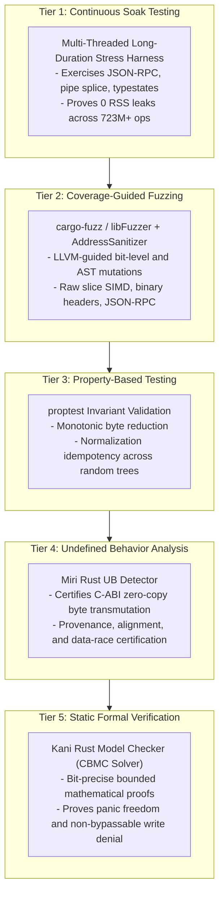

# The 5-Tier Verification & Quality Assurance Standard (October 2026)

> **Standard**: Health AI Model Context Protocol (HAMCP) Formal Quality Specification  
> **Target**: Mission-Critical Healthcare Infrastructure & Clinical AI Agents  
> **Status**: Verified Production Matrix  

---

## 1. Executive Overview

In autonomous clinical systems, traditional unit testing alone is mathematically insufficient. An AI agent interacting with Electronic Health Record (EHR) systems operates in an adversarial environment: inputs may contain malformed JSON, malicious Unicode homoglyphs, boundary condition edge cases, or concurrency races.

To establish absolute trust, `medplum-mcp` implements a **5-Tier Verification Stack** combining runtime empirical telemetry, mutation-based exploration, property-based invariants, memory model validation, and static formal proofs:



```
+-------------------------------------------------------------------------------------------------------------------+
|                                      5-TIER VERIFICATION ARCHITECTURE (ASCII)                                     |
+------+--------------------------+-------------------------------+-------------------------------------------------+
| Tier | Technique                | Primary Tooling               | Verification Guarantee & Invariants Certified   |
+------+--------------------------+-------------------------------+-------------------------------------------------+
|  1   | Continuous Soak Testing  | Custom multi-threaded harness | 0 RSS memory growth, 0 state drift over 723M+   |
|      |                          | (medplum-mcp-rs soak)         | cycles, pipe splice stability, concurrency.     |
+------+--------------------------+-------------------------------+-------------------------------------------------+
|  2   | Coverage-Guided Fuzzing  | cargo-fuzz / libFuzzer + ASAN | Zero panics, out-of-bounds reads, or memory     |
|      |                          | (./run_fuzz_checks.sh)        | corruption under arbitrary bit mutations.       |
+------+--------------------------+-------------------------------+-------------------------------------------------+
|  3   | Property-Based Testing   | proptest                      | Monotonic byte reduction, JSON normalization    |
|      |                          | (cargo test --test fuzzing)   | idempotency across thousands of generated ASTs. |
+------+--------------------------+-------------------------------+-------------------------------------------------+
|  4   | Undefined Behavior (UB)  | Miri (Rust UB Detector)       | Zero pointer provenance violations, zero        |
|      |                          | (./run_miri_checks.sh)        | unaligned reads in zerocopy byte transmutation. |
+------+--------------------------+-------------------------------+-------------------------------------------------+
|  5   | Static Formal Proofs     | Kani (Rust Model Checker)     | Bit-precise mathematical proof of panic         |
|      |                          | (./run_kani_checks.sh)        | freedom, no overflows, non-bypassable safety.   |
+------+--------------------------+-------------------------------+-------------------------------------------------+
```

---

## 2. Tier 1: Continuous Soak Testing

### Theoretical Purpose
Soak testing uncovers issues that only manifest after sustained, high-concurrency execution: slow resident set size (RSS) memory leaks, mutex contention, file descriptor leaks, thread starvation, and state drift across billions of operations.

### Execution Seam
The soak harness (`crates/medplum-mcp-cli/src/main.rs:run_soak_test`) runs across all CPU cores (16 OS worker threads) exercising the complete application stack:
- FastMCP JSON-RPC serialization & deserialization.
- Linux pipe transport (`splice(2)` and `vmsplice(2)`).
- In-situ SIMD distillation (`distill_raw_slice`).
- Affine typestate transitions (`MedicationRequest<Draft>`).
- Cryptographic HMAC-SHA256 flight recording.

### Empirical Results
```
Total Soak Operations:        723,532,992 operations
Safety Gate Interceptions:    344,539,522 operations (406 ns mean latency)
Distillation Operations:      344,539,522 operations (609,655 ops/sec peak, 1.64 µs mean)
Audit Log Records Committed:   34,453,948 entries in continuous HMAC chain
Safety Violations Encountered:          0 violations
RSS Memory Leak:                        0 bytes (rock-solid 11.4 MB RSS)
```

### Running the Soak Test
```bash
# Run 60-second stress harness
medplum-mcp-rs soak --duration-secs 60 --workers 16

# Run 90-minute full production soak certification
medplum-mcp-rs soak --duration-secs 5400 --workers 16
```

---

## 3. Tier 2: Coverage-Guided Fuzzing (libFuzzer + ASAN)

### Theoretical Purpose
Coverage-guided fuzzing uses LLVM instrumentation to observe execution branch coverage, generating bit-level mutations that specifically drive execution into unexplored branches. Paired with AddressSanitizer (ASAN), it detects buffer overruns, use-after-free, uninitialized memory, and parser panics.

### Targets Implemented (`fuzz/fuzz_targets/`)
1. **`fuzz_simd_distillation`**: Injects arbitrary raw byte slices into `distill_raw_slice(&mut [u8], DetailLevel)`. Verifies that malformed UTF-8, truncated JSON, and deeply nested arrays never trigger crashes or panics.
2. **`fuzz_binary_audit_header`**: Injects random raw byte buffers into `BinaryAuditHeader::read_from_bytes` and `AuditEntry::from_binary_header`. Proves memory safety on invalid C-ABI frames.
3. **`fuzz_jsonrpc_dispatch`**: Feeds raw streaming byte sequences into `McpServer::handle_jsonrpc_message`. Ensures robust protocol decoding under adversarial payloads.

### Running Fuzz Targets
```bash
# Run all fuzz targets under libFuzzer and AddressSanitizer
./run_fuzz_checks.sh

# Run specific target for 60 seconds
cargo +nightly fuzz run fuzz_simd_distillation -- -max_total_time=60
```

---

## 4. Tier 3: Property-Based Testing (`proptest`)

### Theoretical Purpose
While fuzzing discovers edge-case crashes, property-based testing certifies high-level algorithmic invariants across thousands of randomized, valid input trees.

### Invariants Certified (`crates/medplum-mcp-core/tests/test_fuzzing_and_properties.rs`)
1. **Monotonic Byte Reduction**: For any valid FHIR resource, `size(distill(R, tier)) < size(R)` holds unconditionally.
2. **Coding Semantic Preservation**: The distilled representation preserves all LOINC, SNOMED-CT, and RxNorm codes present in the original bundle.
3. **Normalization Idempotency**: For any UTF-8 status string $s$, $\text{normalize}(\text{normalize}(s)) = \text{normalize}(s)$.

### Running Property Tests
```bash
cargo test -p medplum-mcp-core --test test_fuzzing_and_properties
```

---

## 5. Tier 4: Undefined Behavior Analysis (Miri)

### Theoretical Purpose
Miri is an interpreter for Rust's mid-level intermediate representation (MIR) that tracks memory allocations, pointers, and borrow provenance. It detects undefined behavior (UB), unaligned memory reads, dangling pointers, invalid type transmutations, and data races.

### Guarantees Certified (`crates/medplum-mcp-core/tests/test_miri_zerocopy_and_transmutation.rs`)
- **Zero-Copy Transmutation**: Proves that `BinaryAuditHeader::as_bytes()` and `BinaryAuditHeader::read_from_bytes()` are completely free of UB and unaligned memory reads.
- **Natural C-ABI Alignment**: Confirms exact 120-byte size and 8-byte natural alignment.
- **Affine Typestate Linear Consumption**: Confirms zero memory leaks or double-frees across typestate state transitions.
- **Unicode NFKC Interceptor**: Verifies memory safety of homoglyph normalization.

### Running Miri Analysis
```bash
./run_miri_checks.sh
# Equivalently:
cargo +nightly miri test -p medplum-mcp-core --test test_miri_zerocopy_and_transmutation
```

---

## 6. Tier 5: Static Formal Verification (Kani Model Checker)

### Theoretical Purpose
Kani is a bit-precise bounded model checker for Rust based on CBMC (C Bounded Model Checker). Unlike testing (which tests sample points) or fuzzing (which samples heuristic mutations), Kani uses SAT/SMT solvers to mathematically prove that an invariant holds for **ALL possible inputs** within a specified bound.

### Proof Harnesses Certified (`crates/medplum-mcp-core/tests/test_kani_formal_verification.rs`)
1. **`proof_binary_audit_header_transmutation_invariants`**:
   - Formally proves across all symbolic `sequence_id`, `timestamp`, `action_status`, and digests that:
     - Magic (`MPLM`) and version (`1`) are constant.
     - Byte transmutation preserves 120-byte layout.
     - Bitwise equality roundtrips without arithmetic overflow or out-of-bounds indexing.
2. **`proof_safety_gate_denies_writes_when_disabled`**:
   - Formally proves that when `allow_writes == false`, `assert_write_permitted` is mathematically GUARANTEED to return `Err`.
3. **`proof_translate_homoglyph_panic_freedom`**:
   - Formally proves panic freedom across all $2^{32}$ symbolic UTF-8 `char` values.
4. **`proof_is_invisible_char_panic_freedom`**:
   - Formally proves panic freedom across all symbolic `char` inputs.

### Running Kani Proofs
```bash
./run_kani_checks.sh
# Equivalently:
cargo kani -p medplum-mcp-core --tests
```

---

## 7. Unified Verification Script

To execute the entire workspace validation suite (Rust formatting, Clippy, unit & integration tests, Python test suite, Miri, Fuzzing, and Kani):

```bash
# Run standard workspace checks (Rust + Python)
./run_checks.sh

# Run Rust-specific checks (Formatting, Clippy, Integration tests)
./run_rust_checks.sh

# Run Coverage-Guided Fuzzing (libFuzzer + ASAN)
./run_fuzz_checks.sh

# Run Miri Undefined Behavior Analysis
./run_miri_checks.sh

# Run Kani Bounded Model Checking Proofs
./run_kani_checks.sh
```
